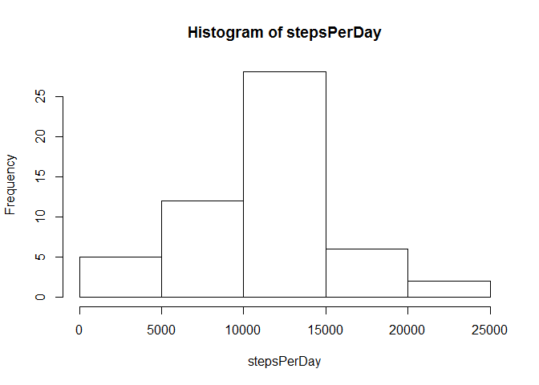
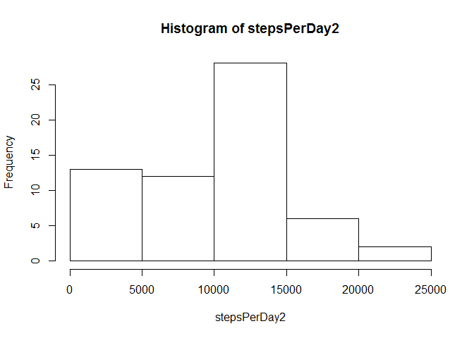
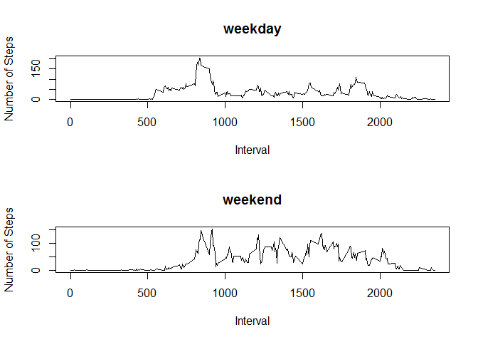

# Reproducible Research: Peer Assessment 1

This is Achin Jindal's submission for PA1 for the course Reproducible Research.

## Loading and preprocessing the data


```r
par(mfrow=c(2,1))
data=read.csv("activity.csv")
  
temp=as.Date(data$date, format="%F")
data$date=temp
  
data_noNA=data[!is.na(data$steps),]
```

## What is mean total number of steps taken per day?


```r
stepsPerDay=tapply(data_noNA$steps, data_noNA$date, sum)
  
hist(stepsPerDay)
```

 

```r
print(median(stepsPerDay))
```

```
## [1] 10765
```

```r
print(mean(stepsPerDay))
```

```
## [1] 10766.19
```

## What is the average daily activity pattern?


```r
stepsPerInterval=tapply(data_noNA$steps, data_noNA$interval, mean)
plot(names(stepsPerInterval), stepsPerInterval, type = "l", xlab="Interval", ylab="Number of Steps")  
```

 

```r
maxInterval=names(which(stepsPerInterval== max(stepsPerInterval)))
print(maxInterval)
```

```
## [1] "835"
```

## Imputing missing values

The methodology followed here is to impute NS values with the median value of steps in the concerned time interval. 


```r
NA_count=nrow(data[is.na(data$steps),])
print(NA_count)
```

```
## [1] 2304
```

```r
data_NAreplaced=data

stepsPerIntervalMedian=tapply(data_noNA$steps, data_noNA$interval, median)
for(i in which(is.na(data$steps),)) data_NAreplaced[i,1]=stepsPerIntervalMedian[which(names(stepsPerIntervalMedian)==data[i,3])]

#nrow(data_NAreplaced[is.na(data2[,1]),])

stepsPerDay2=tapply(data_NAreplaced$steps, data_NAreplaced$date, sum)
hist(stepsPerDay2)
```

 

```r
print(median(stepsPerDay2))
```

```
## [1] 10395
```

```r
print(mean(stepsPerDay2))
```

```
## [1] 9503.869
```

The median and mean of the imputed data is different from that of the original data. Both the median and mean have decreased.

Total daily number of steps has gone up (from 570608 to 579736), since intervals that were being ignored earlier because of the NA value are now being included.

## Are there differences in activity patterns between weekdays and weekends?


```r
day = factor(c("Weekday", "Weekend"))
  data3=cbind(data_NAreplaced, day)
  data3[weekdays(data3[,2]) %in% c("Saturday", "Sunday"),4]="Weekend"
  data3[weekdays(data3[,2]) %in% c("Monday", "Tuesday", "Wednesday", "Thursday", "Friday"),4]="Weekday"
  stepsPerIntervalWeekday=tapply(data3[data3[,4]=="Weekday",1], data3[data3[,4]=="Weekday",3], mean)
  stepsPerIntervalWeekend=tapply(data3[data3[,4]=="Weekend",1], data3[data3[,4]=="Weekend",3], mean)
  par(mfrow=c(2,1))
  plot(names(stepsPerIntervalWeekday), stepsPerIntervalWeekday, type = "l", xlab="Interval", ylab="Number of Steps", main="weekday")
  plot(names(stepsPerIntervalWeekend), stepsPerIntervalWeekend, type = "l", xlab="Interval", ylab="Number of Steps", main="weekend")
```

 
  
